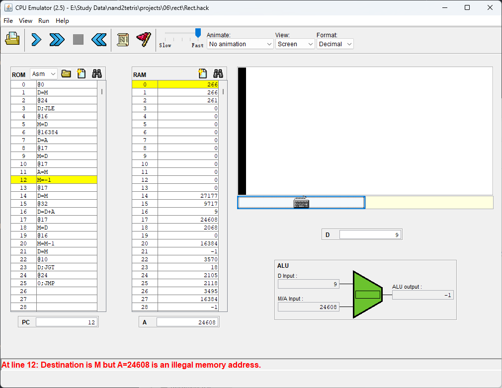

# Project README

Other language: [简体中文](README_CN.md)

**Author:** R7CKB@qq.com

This project is divided into three segments: Paser, Code, and Symbol_Table. The primary goal is to create a simple assembler for the Hack computer architecture. The project is designed to be completed independently to enhance learning.

## Overview

The project consists of three main components:

1. **Parser:** Responsible for parsing each instruction. It identifies the instruction type and extracts relevant information.

2. **Code:** Contains dictionaries for translating different parts of the Hack assembly language into machine code. It covers computation (`comp`), destination (`dest`), and jump (`jump`).

3. **SymbolTable:** Manages symbols, including predefined symbols and user-defined labels. It handles the addition of labels during the first scan and variables during the second scan.

## Usage

To use the assembler, follow these steps:

1. **Create an Assembler Instance:**
    ```python
    file_asm = Assembler("YourFile.asm")
    ```

2. **First Scan:**
    ```python
    file_asm.first_scan()
    ```
    The first scan adds labels to the symbol table.

3. **Second Scan:**
    ```python
    file_asm.second_scan()
    ```
    The second scan adds variables to the symbol table.

4. **Compile:**
    ```python
    file_asm.compile()
    ```
    The `compile` method generates the machine code and writes it to a new Hack file with a `.hack` extension.

## Important Notes

- This assembler assumes a specific syntax and structure for the Hack assembly language. Make sure your assembly code adheres to these guidelines.

- The provided code handles A-instructions, C-instructions, labels, and variables.

- The assembler generates a `.hack` file as output.

- The Rect.hack and RectL.hack will reprt a error, I search this problem in the internet, and use other people's code, this error still exist, So I don't think it's probably my fault.


## Feedback

As a non-native English speaker and a Python rookie, the author welcomes feedback on language use and coding practices. Feel free to point out any mistakes or suggest improvements. The goal is mutual learning and improvement.

Happy coding!